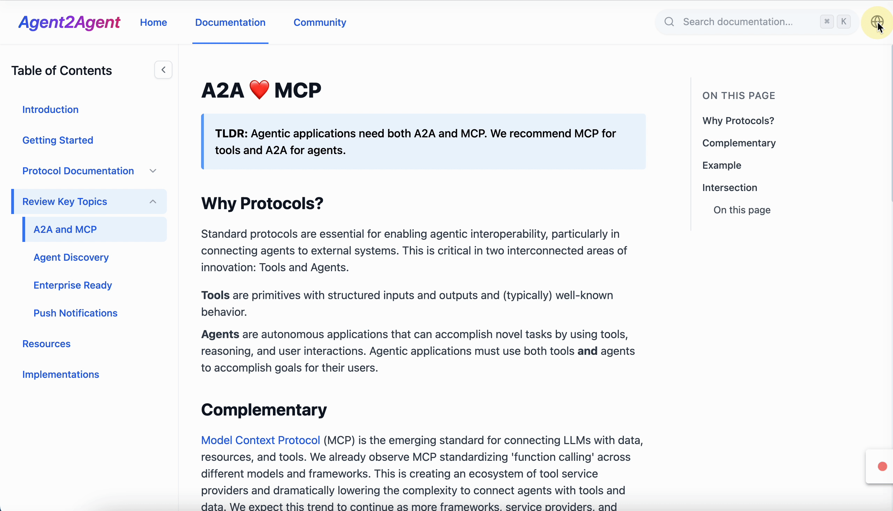

<div align="center">
  <h2 align="center">✨ A2A Protocol Documentation website ✨</h2>
  <p align="center">
    
  </p>
  <p>
      <a href="README.md">English</a> | <a href="README_zh.md">简体中文</a> | <a href="README_ja.md">日本語</a>
  </p>
  <p align="center">
      Agent2Agent Docs – Your comprehensive guide to understanding and implementing the A2A protocol.
  </p>
</div>

# A2A Protocol Documentation


## Introduction

A2A Protocol Documentation is a comprehensive web application built to document and explain the Agent2Agent (A2A) protocol - an open standard for AI agent interoperability developed by Google and partners. This documentation site serves as a user-friendly guide to understanding, implementing, and working with the A2A protocol.

The site features:

- Detailed documentation of the A2A protocol components
- Interactive code samples and examples
- Multilingual support (English, Chinese, and Japanese)
- Responsive design for desktop and mobile
- Full-text search functionality

This project is built with modern web technologies including React, TypeScript, Tailwind CSS, and i18next for internationalization.

## Usage

### Prerequisites

- Node.js (v16 or later)
- npm (v7 or later)

### Installation

1. Clone the repository:
   ```
   git clone https://github.com/your-username/a2a-protocol-docs.git
   cd a2a-protocol-docs
   ```

2. Install dependencies:
   ```
   npm install
   ```

3. Start the development server:
   ```
   npm run dev
   ```

4. Open your browser and navigate to `http://localhost:5173` (or the port indicated in your terminal)

## Project Structure

```
├── public/                  # Static assets
├── src/
│   ├── components/          # Reusable UI components
│   │   ├── protocol/        # Protocol-specific components
│   │   ├── shared/          # Shared UI components
│   │   └── ...
│   ├── context/             # React context providers
│   ├── i18n/                # Internationalization
│   │   ├── locales/         # Language translations
│   │   │   ├── en/          # English
│   │   │   ├── zh/          # Chinese
│   │   │   └── ja/          # Japanese
│   │   └── index.ts         # i18n configuration
│   ├── layouts/             # Page layout components
│   ├── pages/               # Page components
│   │   ├── keyTopics/       # Key topics pages
│   │   ├── protocol/        # Protocol documentation pages
│   │   └── ...
│   ├── types/               # TypeScript type definitions
│   ├── utils/               # Utility functions
│   ├── App.tsx              # Application entry point
│   ├── main.tsx             # Main rendering
│   └── index.css            # Global styles
├── .eslintrc.js             # ESLint configuration
├── index.html               # HTML template
├── package.json             # Project dependencies
├── tailwind.config.js       # Tailwind CSS configuration
├── tsconfig.json            # TypeScript configuration
└── vite.config.ts           # Vite configuration
```

## Deployment

This project can be deployed using various hosting platforms. Here are instructions for common deployment methods:

### Build for Production

Generate a production build:

```bash
npm run build
```

This will create a `dist` directory with optimized production files.

### Deploying to Netlify

1. Push your code to a GitHub repository
2. Log in to Netlify
3. Click "New site from Git" and select your repository
4. Use the following build settings:
   - Build command: `npm run build`
   - Publish directory: `dist`
5. Click "Deploy site"

### Deploying to Vercel

1. Push your code to a GitHub repository
2. Log in to Vercel
3. Click "Import Project" and select your repository
4. Use the following build settings:
   - Framework Preset: Vite
   - Build command: `npm run build`
   - Output directory: `dist`
5. Click "Deploy"

### Deploying to GitHub Pages

1. Install gh-pages package:
   ```bash
   npm install --save-dev gh-pages
   ```

2. Add the following to your package.json:
   ```json
   "homepage": "https://your-username.github.io/a2a-protocol-docs",
   "scripts": {
     "predeploy": "npm run build",
     "deploy": "gh-pages -d dist"
   }
   ```

3. Run deploy command:
   ```bash
   npm run deploy
   ```

## Contributing

Contributions are welcome! Please feel free to submit a Pull Request.

## License

This project is licensed under the MIT License - see the LICENSE file for details.

