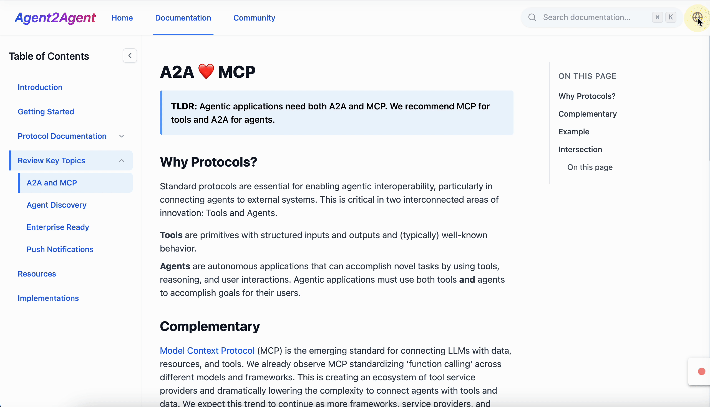

<div align="center">
  <h2 align="center">✨ A2A プロトコル ドキュメントサイト ✨</h2>
  <p align="center">
    
  </p>
  <p>
      <a href="README.md">English</a> | <a href="README_zh.md">简体中文</a> | <a href="README_ja.md">日本語</a>
  </p>
  <p align="center">
      Agent2Agent ドキュメント – A2A プロトコルを理解し実装するための包括的なガイド。
  </p>
</div>

# A2A プロトコル ドキュメント


## はじめに

A2A プロトコル ドキュメントは、Google とパートナーによって開発された AI エージェント相互運用性のためのオープンスタンダードである Agent2Agent (A2A) プロトコルを文書化し、説明するために構築された包括的な Web アプリケーションです。このドキュメントサイトは、A2A プロトコルの理解、実装、および操作のためのユーザーフレンドリーなガイドとして機能します。

サイトの特徴：

-   A2A プロトコルコンポーネントの詳細なドキュメント
-   インタラクティブなコードサンプルと例
-   多言語対応（英語、中国語、日本語）
-   デスクトップおよびモバイル向けのレスポンシブデザイン
-   全文検索機能

このプロジェクトは、React、TypeScript、Tailwind CSS、および国際化のための i18next を含む最新の Web 技術で構築されています。

## 使用方法

### 前提条件

-   Node.js (v16 以降)
-   npm (v7 以降)

### インストール

1.  リポジトリをクローンします：
    ```
    git clone https://github.com/your-username/a2a-protocol-docs.git
    cd a2a-protocol-docs
    ```

2.  依存関係をインストールします：
    ```
    npm install
    ```

3.  開発サーバーを起動します：
    ```
    npm run dev
    ```

4.  ブラウザを開き、`http://localhost:5173` (またはターミナルに表示されたポート) にアクセスします。

## プロジェクト構成

```
├── public/                  # 静的アセット
├── src/
│   ├── components/          # 再利用可能なUIコンポーネント
│   │   ├── protocol/        # プロトコル固有のコンポーネント
│   │   ├── shared/          # 共有UIコンポーネント
│   │   └── ...
│   ├── context/             # React Context プロバイダー
│   ├── i18n/                # 国際化
│   │   ├── locales/         # 言語翻訳
│   │   │   ├── en/          # 英語
│   │   │   ├── zh/          # 中国語
│   │   │   └── ja/          # 日本語
│   │   └── index.ts         # i18n 設定
│   ├── layouts/             # ページレイアウトコンポーネント
│   ├── pages/               # ページコンポーネント
│   │   ├── keyTopics/       # 主要トピックページ
│   │   ├── protocol/        # プロトコル文書ページ
│   │   └── ...
│   ├── types/               # TypeScript 型定義
│   ├── utils/               # ユーティリティ関数
│   ├── App.tsx              # アプリケーションエントリーポイント
│   ├── main.tsx             # メインレンダリング
│   └── index.css            # グローバルスタイル
├── .eslintrc.js             # ESLint 設定
├── index.html               # HTML テンプレート
├── package.json             # プロジェクト依存関係
├── tailwind.config.js       # Tailwind CSS 設定
├── tsconfig.json            # TypeScript 設定
└── vite.config.ts           # Vite 設定
```

## デプロイ

このプロジェクトは、さまざまなホスティングプラットフォームを使用してデプロイできます。一般的なデプロイ方法の手順は次のとおりです：

### 本番ビルド

本番ビルドを生成します：

```bash
npm run build
```

これにより、最適化された本番ファイルを含む `dist` ディレクトリが作成されます。

### Netlify へのデプロイ

1.  コードを GitHub リポジトリにプッシュします
2.  Netlify にログインします
3.  "New site from Git" をクリックし、リポジトリを選択します
4.  以下のビルド設定を使用します：
    -   ビルドコマンド： `npm run build`
    -   公開ディレクトリ： `dist`
5.  "Deploy site" をクリックします

### Vercel へのデプロイ

1.  コードを GitHub リポジトリにプッシュします
2.  Vercel にログインします
3.  "Import Project" をクリックし、リポジトリを選択します
4.  以下のビルド設定を使用します：
    -   フレームワークプリセット： Vite
    -   ビルドコマンド： `npm run build`
    -   出力ディレクトリ： `dist`
5.  "Deploy" をクリックします

### GitHub Pages へのデプロイ

1.  gh-pages パッケージをインストールします：
    ```bash
    npm install --save-dev gh-pages
    ```

2.  `package.json` に以下を追加します：
    ```json
    "homepage": "https://your-username.github.io/a2a-protocol-docs",
    "scripts": {
      "predeploy": "npm run build",
      "deploy": "gh-pages -d dist"
    }
    ```
    *`your-username` と `a2a-protocol-docs` を実際の GitHub ユーザー名とリポジトリ名に置き換えてください。*

3.  デプロイコマンドを実行します：
    ```bash
    npm run deploy
    ```

## コントリビューション

コントリビューションを歓迎します！お気軽に Pull Request を送信してください。

## ライセンス

このプロジェクトは MIT ライセンスの下でライセンスされています - 詳細は LICENSE ファイルを参照してください。
